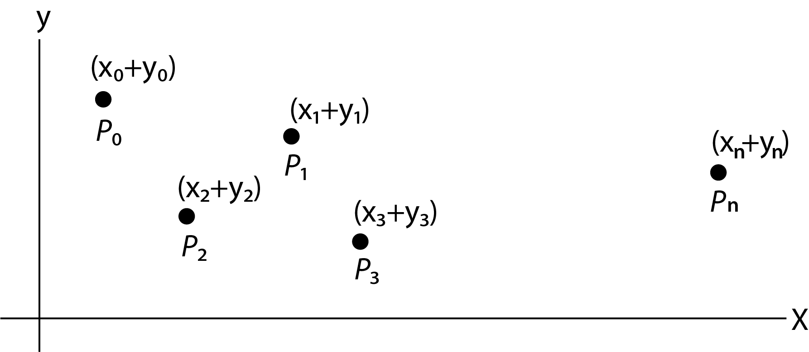
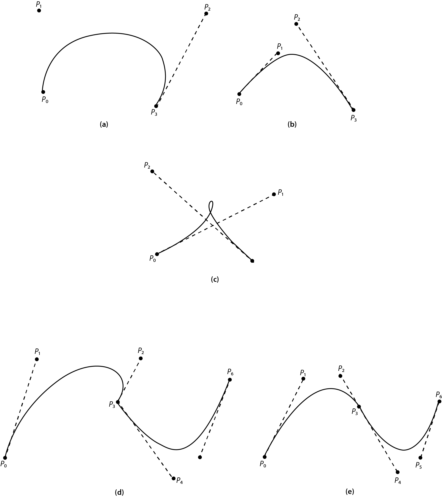
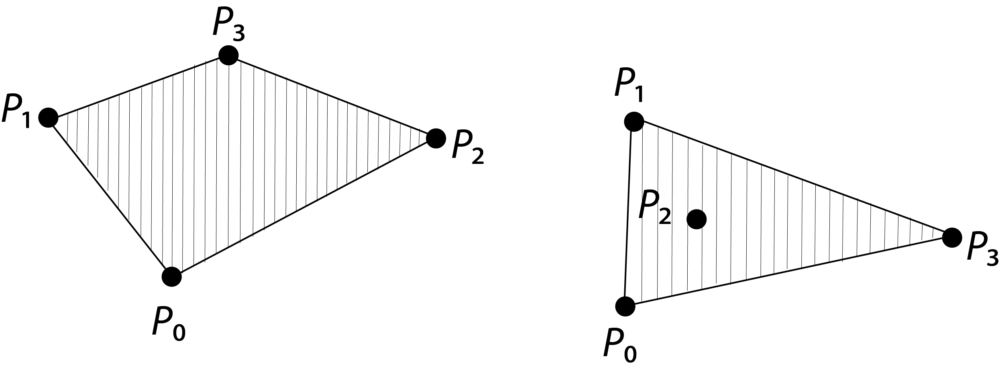

&emsp; We discuss Bezier curves first. Bezier curves are named after the French engineer P. Bezier of the Renault Automobile Company. He developed them in the early 1960s to fill a need for curves whose shape can be readily controlled by changing a few parameters. Bezier's application was to construct pleasing surfaces for car bodies.

&emsp; Suppose we are given a set of control points, <i>Pi = (xi , yi),  i = 0, 1, . . ., n.</i> (These points are also referred to as <i>Bezier points</i>.) Figure 1 is an example.

&emsp; These points could be chosen on a computer screen, using a pointing device. The points do not necessarily progress from left to right. We treat the coordinates of each point as a two-component vector.

$$ P_i = \begin{bmatrix}
   x_i \\ y_i
\end{bmatrix} $$

The set of points, in parametric form, is

$$ P(u) = \begin{bmatrix}
   x(u) \\ y(u)
\end{bmatrix}, \qquad 0 \le u \le 1. $$

The nth-degree Bezier polynomial determined by n + 1 points is given by

$$ \text{Figure 1} $$

   $$
   P(u) = \sum_{i=0}^n\binom{n}{i}(1 - u)^{n-i}u^iP_i,
   $$
   
where

   $$ 
      \binom{n}{i} = \frac{n!}{i!(n-i)!} $$

 

<i>P(u)</i> is actually a <i>Bernstein polynomial</i>. Bernstein showed in 1912 that a weighted sum of these polynomials will converge uniformly to any continuous function on the interval [0, 1] as <i>n</i> approaches infinity. (Maple knows the Bernstein polynomials. The command is in a library: 'bernstein'.)

&emsp; When <i>n</i> = 2, <i>P(u)</i> is a quadratic equation defined by three points, <i>p0, p1, and p2</i> :

$$
P(u) = (1)(1-u)^2p_0 + 2(1-u)(u)p_1 + (1)u^2p_2,
$$

   because, for <i>n</i> = 2 and <i>i</i> = 0,1,2, we have $$\binom{2}{0}=1$$, $$\binom{2}{1}=2$$, $$\binom{2}{2}=1$$. The preceding equation represents the pair of equations 

$$
\boxed{

   \begin{aligned}
      x(u) &= (1-u)^2x_0 + 2(1-u)ux_1 + u^2x_2, \\ 
      y(u) &= (1-u)^2y_0 + 2(1-u)uy_1 + u^2y_2.
   \end{aligned}
}
$$

Obserye that, if <i>u</i> = 0, <i>x</i>(0) is identical to <i>x0</i> and similarly for <i>y</i>(0). If <i>u</i> = 1, the point referred to is <i>(x2,y2)</i>. As <i>u</i> takes on values between 0 and 1, a curve is traced that goes from the first point to the third of the set. Ordinarily the curve will not pass through the central point of the three. (If the points are collinear, the curve is the straight line through them all.) In effect, the points of the second-degree Bezier curve have coordinates that are weighted sums of the coordinates of the three points that are used to define it. From another point of view, one can think of the Bezier equations as weighted sums of three polynomials in <i>u</i>, where the weighting factors are the coordinates of the three points.

&emsp; In one of the exercises, you are to find the Bezier curve for seven points, with <i>(x(0), y(0)) = P0, (x(1), y(1)) = P3, and (x(2),y(2)) = P6</i>.

&emsp; Applying the general defining equation for <i>n</i> = 3, we get the cubic Bezier polynomial that we now consider in some detail. The properties of other Bezier polynomials are the same as for the cubic. Here is the Bezier cubic:

$$
\boxed{
   \begin{aligned}
      x(u) &= (1-u)^3x_0 +3(1-u)^2ux_1 + 3(1-u)u^2x_2 + u^3x_3, \\
      y(u) &= (1-u)^3y_0 +3(1-u)^2uy_1 + 3(1-u)u^2y_2 + u^3y_3.
   \end{aligned}
}
$$

&emsp; Observe again that <i>(x(0), y(0)) = p0</i> and <i>(x(1),y(1)) = p3</i> and that the curve will not ordinarily go through the intermediate points. As illustrated in the example curves in Figure 2, changing the intermediate "control" points changes the shape ofthe curve. The examples are in Figure 2a through e. The first three of these show Bezier curves defined by one group of four points.

 

$$\text{Figure 2: Bezier curves defined by four and seven points}$$

&emsp;Figure 2d and e demonstrate how cubic Bezier curves can be continued beyond the first set of four points; one just subdivides seven points (<i>p0</i> to <i>p6</i>) into two groups of four, with the central one (<i>p3</i>) belonging to both sets. Figure 2e shows that <i>p2, p3</i> and <i>p4</i> must be collinear to avoid a discontinuity in the slope at <i>p3</i>.

&emsp; It is of interest to list the properties of Bezier cubics:

   <ol type="1">
      <li>
         <i>P(0) = p0,&emsp; P(1) = p3.</i>
      </li>
      <li>
         Because <i>dx/du = 3(x1 - x0) and dy/du = 3(y1 - y0) at u = 0</i>, the slope of the curve at <i>u</i> = 0 is <i>dy/dx = (y1 - y0)/(x1 - x0)</i>, which is the slope of the secant line between <i>p0 and p1</i>. Similarly, the slope at <i>u</i> = 1 is the same as the secant line between the last two points. This is indicated in the figures by dashed lines.
      </li>
      <li>
         The Bezier curve is contained in the convex hull determined by the four points.
      </li>
   </ol>

 

&emsp; The <i>convex hull</i> of a set of points is the smallest convex set that contains the points. A set, <i>C</i>, is <i>convex</i> if and only if the line segment between any two points in the set lies entirely in set <i>C</i>. The following sketches show examples of the convex hull of four points.

 

&emsp; It is often convenient to represent the Bezier curve in matrix form. For Bezier cubics, this is

$$
\begin{aligned}
   P(u) &= \begin{bmatrix}
      u^3, & u^2, & u, & 1
   \end{bmatrix}
   \begin{bmatrix}
      -1 & 3 & -3 & 1 \\
      3 & -6 & 3 & 0 \\
      -3 & 3 & 0 & 0 \\
      1 & 0 & 0 & 0
   \end{bmatrix}
   \begin{bmatrix}
      p_0 \\ p_1 \\ p_2  \\ p_3
   \end{bmatrix} \\ \\
   &= u^TM_2p.
\end{aligned}
$$

   